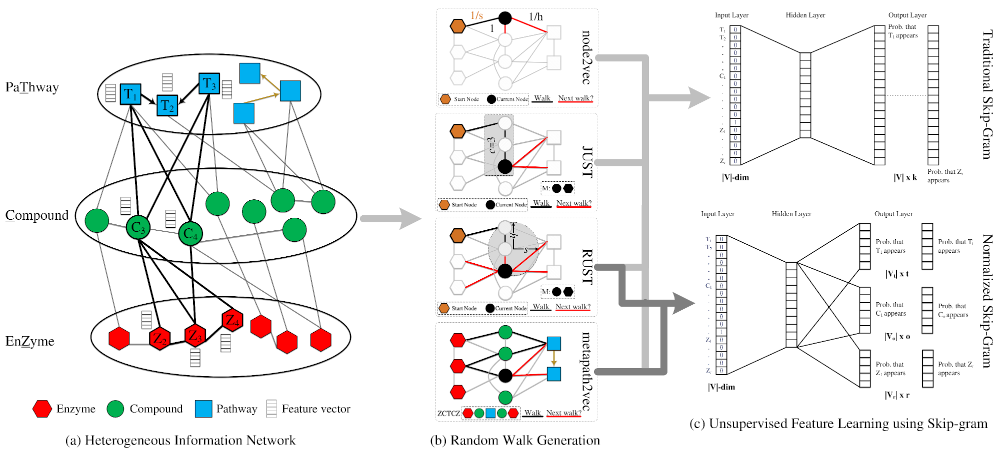

## Basic Description
This repo contains an implementation of *pathway2vec*, a software package consisting of six representational learning-based modules used to automatically generate features for the downstream pathway inference task. Specifically, pathway2vec builds a three-layered network composed of compounds, enzymes, and pathways, where nodes within a layer manifest inter-interactions and nodes between layers manifest betweenness interactions. This layered architecture captures relevant relationships used to learn a neural embedding-based low-dimensional space of metabolic features. The algorithms in pathway2vec were benchmarked based on node-clustering, embedding visualization and pathway prediction using MetaCyc as a trusted source. Remarkably, in the pathway prediction task, results indicate that it is possible to leverage embeddings to improve pathway prediction outcomes.

## Dependencies
The codebase is tested to work under Python 3.5. To install the necessary requirements, run the following commands:

``pip install -r requirements.txt``

Basically, *pathway2vec* requires following packages:
- [Anaconda](https://www.anaconda.com/)
- [tensorflow](https://www.tensorflow.org/) (== 1.10)
- [NumPy](http://www.numpy.org/) (>= 1.15)
- [scikit-learn](https://scikit-learn.org/stable/) (>= 0.20)
- [pandas](http://pandas.pydata.org/) (>= 0.23)
- [NetworkX](https://networkx.github.io/) (>= 2.2)
- [gensim](https://radimrehurek.com/gensim/) (== 3.7)
- [scipy](https://www.scipy.org/index.html) (==1.2)

## Experimental Objects and Test Samples
Please download the following preprocessed files from [Zenodo](https://zenodo.org/record/3711103#.Xm1lEHVKjeQ). 
- The link contains following preprocessed graphs:
    - "ec_graph.pkl": the EC graph, which is a set of ECs with interactions.
    - "compound_graph.pkl": the compound graph, which is a set of compounds with interactions.
    - "pathway_graph.pkl": the pathway graph, which is a set of pathways with interactions.
    - "ec2compound.pkl": mapping file from the EC layer onto the compound layer.
    - "compound2pathway.pkl": mapping file from the compound layer onto the pathway layer.
    - "ec2pathway.pkl": mapping file from the EC layer onto the pathway layer.
- We also provided pretrained models and samples for testing:
    - "hin.pkl": a sample of heterogeneous information network, which is used to generate walks. Based on your tests, you need to generate a heterogeneous information network during preprocessing step. You many use "hin.pkl" to peek into the structure.
    - "X_hin.txt": a sample of generated walks, which is used to learn embeddings. Each line encode a walk rooted at a node beginning of the line. Based on your tests, you need to generate walks during random walks step. You many use "hin.pkl" as a test sample.
    - "pathway2vec_embeddings.npz": a sample of embeddings (nodes x dimension size). Based on your tests, you need to learn embeddings walks during training step. You many use "hin.pkl" and "X_hin.txt" as test samples.

## Installation and Basic Usage
Run the following commands to clone the repository to an approriate location:

``git clone https://github.com/hallamlab/pathway2vec.git``

For all experiments, navigate to ``src`` folder then run the commands of your choice. For example, to display *pathway2vec*'s running options use: `python main.py --help`. It should be self-contained. 

### Preprocessing graph
To preprocess graphs, we provide few examples. For all examples: *--hin-file* corresponds to the desired generated file name, ending with *.pkl*.

**Please** do not use the sample "hin.pkl" during this step, and change the name of the generated hin file or store the provided "hin.pkl" in a different folder to avoid conflict.

#### Example 1
To preprocess three layer graph **all connected**, execute the following command:

``python main.py --preprocess-dataset --first-graph-name "ec_graph.pkl" --second-graph-name "compound_graph.pkl" --third-graph-name "pathway_graph.pkl" --first-mapping-file-name "ec2compound.pkl" --second-mapping-file-name "compound2pathway.pkl" --hin-file "[Name of the hin file].pkl" --ospath [Location to all the files] --logpath "[Location to the log directory]" --num-jobs 2``

#### Example 2
To preprocess three layer graph **excluding the connection of the first graph**, execute the following command:

``python main.py --preprocess-dataset --first-graph-not-connected --first-graph-name "ec_graph.pkl" --second-graph-name "compound_graph.pkl" --third-graph-name "pathway_graph.pkl" --first-mapping-file-name "ec2compound.pkl" --second-mapping-file-name "compound2pathway.pkl" --hin-file "[Name of the hin file].pkl" --ospath [Location to all the files] --logpath "[Location to the log directory]" --num-jobs 2``

where *--first-graph-not-connected* enables exclusion of connection among the nodes in the first layer.

#### Example 3
To preprocess three layer graph while **removing isolates**, execute the following command:

``python main.py --preprocess-dataset --remove-isolates --first-graph-name "ec_graph.pkl" --second-graph-name "compound_graph.pkl" --third-graph-name "pathway_graph.pkl" --first-mapping-file-name "ec2compound.pkl" --second-mapping-file-name "compound2pathway.pkl" --hin-file "[Name of the hin file].pkl" --ospath [Location to all the files] --logpath "[Location to the log directory]" --num-jobs 2``

where *--remove-isolates* enables the isolation of nodes less than 2 connectivity.

#### Example 4
To preprocess **two layers graph**, execute the following command:

``python main.py --preprocess-dataset --exclude-third-graph --first-graph-name "ec_graph.pkl" --second-graph-name "pathway_graph.pkl" --first-mapping-file-name "ec2pathway.pkl" --hin-file "[Name of the hin file].pkl" --ospath [Location to all the files] --logpath "[Location to the log directory]" --num-jobs 2``

where *--exclude-third-graph* enables the including two layers only.

### Generate Walks
To generate walks, we provide few examples. 

Description about arguments in all of given examples: *--burn-in-phase* is the burn in phase time to compute transition probability prior to generating walks, *--burn-in-input-size* is subsampling size of the number of walks and length for burn in phase. These two arguments are set by defualt to 1 and 0.5. The arguments *--walk-length* corresponds length of walk per source while *--num-walks* is number of generated walks per source node. *--file-name* corresponds to the desired graph file name and generated walks, excluding any *EXTENSION* (e.g. "hin"). Two files will be resulted one will have *.txt* suffix and *X_* prefix while the graph whill have *.pkl* extension. 

**Please** do not use the sample "X_hin.txt" during this step, and change the name of the generated walks or store the provided "X_hin.txt" in a different folder to avoid conflict.

#### Example 1
To generate *node2vec* random walks, execute the following command:

``python main.py --extract-instance --burn-in-phase 1 --burn-in-input-size 0.3 --q 0.5 --walk-length 10 --num-walks 5 --hin-file "[Name of the hin file].pkl" --file-name "[Name of the file without extension]" --ospath [Location to the hin file] --dspath [Location to store the generated walks] --logpath "[Location to the log directory]" --num-jobs 2``

where *--q* represents in-out parameter that allows the search to differentiate between "inward" and "outward" nodes. The return parameter that controls the likelihood of immediately revisiting a node in the walk will be automatically adjusted.

#### Example 2
To generate *metapath2vec* random walks, execute the following command:

``python main.py --extract-instance --burn-in-phase 1 --burn-in-input-size 0.3 --walk-length 10 --num-walks 5 --metapath-scheme "ECTCE" --use-metapath-scheme --hin-file "[Name of the hin file].pkl" --file-name "[Name of the file without extension]" --ospath [Location to the hin file] --dspath [Location to store the generated walks] --logpath "[Location to the log directory]" --num-jobs 2``

#### Example 3
To generate *JUST* random walks, execute the following command:

``python main.py --extract-instance --burn-in-phase 1 --burn-in-input-size 0.3 --walk-length 10 --num-walks 5 --just-type --just-memory-size 2 --hin-file "[Name of the hin file].pkl" --file-name "[Name of the file without extension]" --ospath [Location to the hin file] --dspath [Location to store the generated walks] --logpath "[Location to the log directory]" --num-jobs 2``
    
#### Example 4
To generate *RUST* random walks, execute the following command with :

``python main.py --extract-instance --burn-in-phase 3 --burn-in-input-size 0.3 --q 0.3 --walk-length 10 --num-walks 5 --just-type --just-memory-size 3 --hin-file "[Name of the hin file].pkl" --file-name "[Name of the file without extension]" --ospath [Location to the hin file] --dspath [Location to store the generated walks] --logpath "[Location to the log directory]" --num-jobs 2``

For RUST, it is better to use *--burn-in-phase = 3*. *--file-name* corresponds to the desired file name, excluding any *EXTENSION*. The file will have *.txt* extension. The argument *--q* represents the probability to explore within layer nodes (breadth-search). The in-depth search will be automatically adjusted based on unit circle equation.

### Train
To learn embeddings using random walks, we provide few examples. 

Description about arguments in all of given examples: *--file-name* corresponds to the *.txt* generate walks and *--model-name* corresponds the name of the models (excluding any *EXTENSION*). The model name will have *.npz* extension where each row indicate a node, having some predefined dimension size. *--constraint-type* enables the normalized skip gram model and *fit-by-word2vec* enables to train using gensim package.

**Please** do not use the sample "pathway2vec_embeddings.npz" during this step, and change the name of the embeddings file or store the provided "pathway2vec_embeddings.npz" in a different folder to avoid conflict.

#### Example 1
To learn embeddings using dimension size *--embedding-dim* 128, context size *--window-size* 3, Number of samples to be considered within defined context size *--num-skips* 2, execute the following command:

``python main.py --train --embedding-dim 128 --num-skips 2 --window-size 3 --hin-file "[Name of the generated hin file].pkl" --file-name "[Name of the .txt file]" --model-name "[Model name without extension]" --mdpath [Location for storing the learned embeddings] --rspath "[Location for storing costs]" --logpath "[Location to the log directory]" --num-epochs 3 --num-jobs 2``

#### Example 2
To learn embeddings using the same above parameter settings but with *metapath2vec++*, execute the following command:

``python main.py --train --constraint-type --embedding-dim 128 --num-skips 2 --window-size 3 --hin-file "[Name of the hin file].pkl" --file-name "[Name of the .txt file]" --model-name "[Model name without extension]" --mdpath [Location for storing the learned embeddings] --rspath "[Location for storing costs]" --logpath "[Location to the log directory]" --num-epochs 3 --num-jobs 2``

#### Example 3
To learn embeddings using the same above parameter settings but with *metapath2vec++* and trained using *gensim* package, execute the following command:

``python main.py --train --fit-by-word2vec --constraint-type --embedding-dim 128 --num-skips 2 --window-size 3 --hin-file "[Name of the hin file].pkl" --file-name "[Name of the .txt file]" --model-name "[Model name without extension]" --mdpath [Location for storing the learned embeddings] --rspath "[Location for storing costs]" --logpath "[Location to the log directory]" --num-epochs 3 --num-jobs 2``

## Citing
If you find _pathway2vec_ useful in your research, please consider citing the following paper:
- M. A. Basher, Abdur Rahman, and Hallam, Steven J.. **["Leveraging Heterogeneous Network Embedding for Metabolic Pathway Prediction"](https://www.biorxiv.org/content/10.1101/2020.02.20.940205v2.abstract)**, bioRxiv (2020).

## Contact
For any inquiries, please contact: [arbasher@alumni.ubc.ca](mailto:arbasher@alumni.ubc.ca)

## Upcoming features
- Make the random walks generation more efficient.
